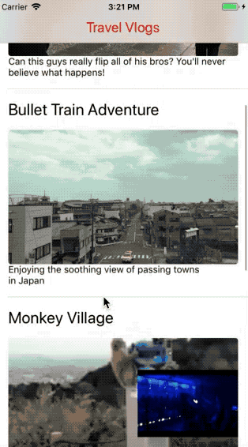

TravelVlogs
--------------------

TravelVlogs项目是介绍如何使用AVKit和AVFoundation框架构建简单的视频流应用。

## 预览图




## 代码

[TravelVlogs](https://github.com/andyRon/LearniOSByProject/tree/master/118-TravelVlogs)

## 注意点

### AVKit 介绍

**一个有用的开发智慧：始终支持您可用的最高抽象级别。 然后，当您使用的不再适合您的需求时，您可以降低到较低的水平**。 根据这一建议，您将在最高级别的视频框架中开始您的旅程。

AVKit位于AVFoundation之上，提供与视频交互所需的所有UI。


### AVFoundation介绍

`AVFoundation`是一个巨大的类，这个项目用到一些类：
- `AVPlayerLayer`： 这个特殊的CALayer子类可以显示给定AVPlayer对象的回放。
- `AVAsset`：这些是媒体资产的静态表示。 资产对象包含持续时间和创建日期等信息。
- `AVPlayerItem`：`AVAsset`的动态对应物。 此对象表示可播放视频的当前状态。

// 这是您需要为AVPlayer提供的东西。


### 本地视频播放

`AVPlayer`（播放器对象）是iOS中播发视频的核心。它可以启动和停止视频，更改播放速率甚至可以上下调节音量。 您可以将播放器视为能够一次管理一个媒体资源播放的控制器对象。

### 远程视频播放

```
let videoURLString = "https://wolverine.raywenderlich.com/content/ios/tutorials/video_streaming/foxVillage.mp4"

let videoURLString = "https://wolverine.raywenderlich.com/content/ios/tutorials/video_streaming/foxVillage.m3u8"
```

上面两个URL的唯一的区别是第二个URL代表HLS Livestream。 HLS Livestream通过将视频分成块来提升视频加载速度。 

### 右下角的小视图

右下角的小视图是一个浮动的自定义视频播放器。 它的目的是播放一组循环剪辑，让用户对所有这些视频感到兴奋。

循环时需要用到类似OC中的KVO(基本思想就是在特定属性的值发生变化时得到通知)。


### 右下角的小视图两个手势

- 点击一次打开关闭声音
- 双击两倍播放速度

### 当大视频播发时要把小视图自定义视频播放器的视频播放关闭


### 让视频播放不要影响其他音乐应用的音乐播放

在`AppDelegate.swift`的 `application(_:didFinishLaunchingWithOptions:)`方法添加一段如下代码：

```swift
try? AVAudioSession.sharedInstance().setCategory(AVAudioSession.Category.ambient, mode: AVAudioSession.Mode.moviePlayback, options: [.mixWithOthers])
```

## 参考

[Video Streaming Tutorial for iOS: Getting Started](https://www.raywenderlich.com/5191-video-streaming-tutorial-for-ios-getting-started)