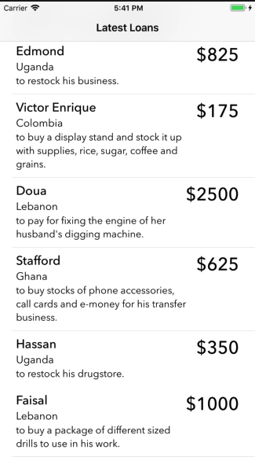
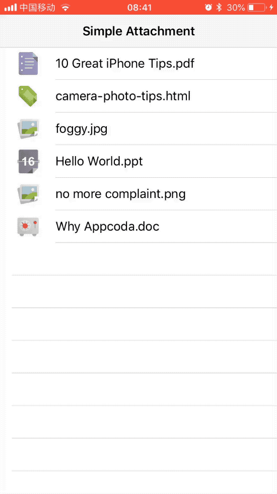

《Intermediate iOS Programming with Swift》
---------

 appcoda 网站书籍 [Intermediate iOS Programming with Swift](https://www.appcoda.com/intermediate-swift-programming-book/) 的学习笔记。

 每一节是一个项目

###  SimpleRSSReader
XML解析。

                  

### TableCellAnimation
TableViewCell加载动画。

### KivaLoan
JSON解析

### SocialSharingDemo ??

### EmailAttachment  
发送带附件邮件。不能是模拟器。

### RecordPro   ??
录音
- `AV Foundation` 提供两个APIs `AVAudioPlayer` `AVAudioRecorder`
- **RecordPro**

### SimpleCamera  ??
13

- iOS 提高两种内置的照相使用方式：`UIImagePickerController`  和 **AVFoundation framework**。
- ?? AVCaptureStillImageOutput iOS 10弃用，改用 AVCapturePhotoOutput

### Chapter 15 Displaying Banner Ads using Google AdMob
- 注册Google AdMob账号
- 在Google AdMob中创建名为*GoogleAdMobDemo*的app
https://apps.admob.com/v2/apps/5351885256/adunits/list     ??

### Chapter 21 Building a Taday Widget
- iOS and macOS define several types of app extensions, each of which is tied to a single, well-scoped area of the system, such as sharing, Notification Center, and the iOS keyboard. A system area that enables extensions is called an extension point. Each extension point defines usage policies and provides APIs that you use when you create an app extension for that area. You choose an extension point based on the functionality you want to provide.
- https://developer.apple.com/library/content/documentation/General/Conceptual/ExtensibilityPG/index.html
- iOS 中的 *extension point*
    + **Today**
    + **Share**
    + **Action**
    + **Photo Editing**
    + **Document Provider**
    + **Custom Keyboard**
    + **iMessage**
    + **Notifications**
- **App Extensions**工作原理
    + not standalone apps
    + An extension is delivered via the App Store as part of an app bundle. **container app**  **host app**
    + 每个扩展都有自己的进程，和 **container app** 不是同一个进程
    + 不同扩展的进程也是不同的
    + 

### WeatherDemo ??
